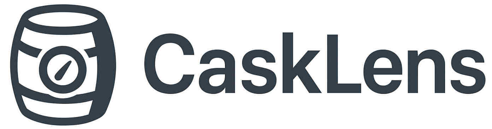

# **CaskLens**

## What is CaskLens?
CaskLens is a modern browser-based tool that fetches and parses Homebrew Cask metadata directly from official Homebrew sources. It helps developers and power users inspect application details with clarity and speed — all without using a single terminal command.

You can browse:

* Version details
* Installation URLs
* SHA256 checksum
* Dependencies
* Artifacts
* Tap/source metadata
* Full JSON representation
* Language & variation details
* Deprecation/disable status
* Favicon preview of each app’s homepage

---

## ⭐ Features

### 🔍 **Powerful Cask Search**

Instantly search across thousands of Homebrew casks with pagination and fast filtering.
Filter by name, cask-token, descritpion keywords etc.

### 🌗 **Dynamic Light/Dark Theme**

Entire UI (body, cards, header, modals) updates instantly when switching themes.

## 🖥️ Supported Platforms

| Platform          | Supported | Notes                             |
| ----------------- | --------- | --------------------------------- |
| **macOS**         | ✅         | Best experience; Homebrew-native  |

## 🧰 Use Cases

###  **Developers**

Inspect metadata, versions, URLs, dependencies while building or debugging casks.

###  **Security / Compliance Teams**

Verify download URLs, SHA256 checksums, and source authenticity.

###  **SysAdmins**

Audit applications before deploying to managed macOS environments.

###  **Homebrew Contributors**

Quickly investigate cask structure before making pull requests.

###  **General Users**

Discover new macOS apps available via Homebrew — without using Terminal.

## 🤝 Contributing

Contributions, feature suggestions, and pull requests are always welcome.
Open an issue to request fixes, enhancements, or new features.

